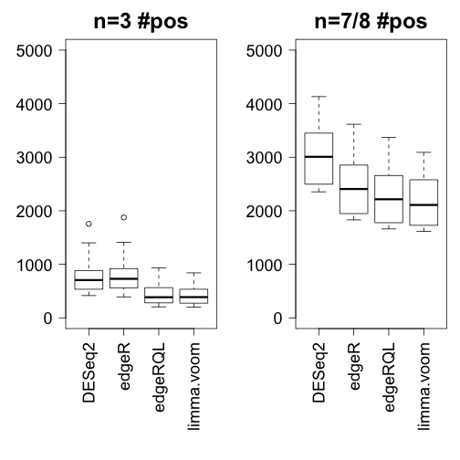
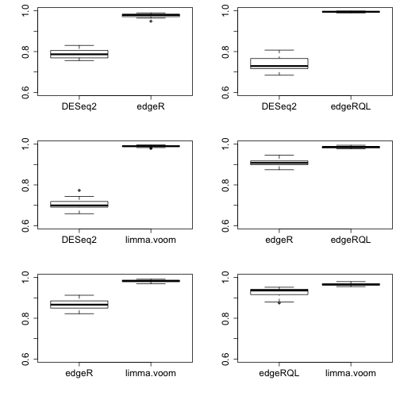
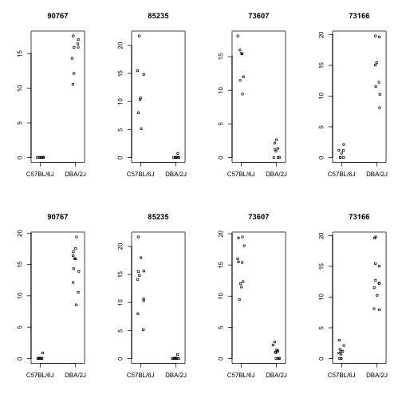

# Bottomly plots


### Condition and batch in test and heldout


```r
# plot the test and heldout sets coloring condition and batch
library(rafalib)
bigpar(2,2)
cols <- c("orange","purple","dodgerblue")
image(sapply(1:30, function(i) as.integer(strain[randomSubsets[i,1:6],])),
      col=cols, main="test cond")
image(sapply(1:30, function(i) as.integer(exper[randomSubsets[i,1:6],])),
      col=cols, main="test batch")
image(sapply(1:30, function(i) as.integer(strain[randomSubsets[i,7:21],])),
      col=cols, main="out cond")
image(sapply(1:30, function(i) as.integer(exper[randomSubsets[i,7:21],])),
      col=cols, main="out batch")
```


### Number of calls


```r
bigpar(1,2,mar=c(10,5,3,1))
boxplot(test, las=2, ylim=c(0,5000), main="n=3 #pos")
boxplot(held, las=2, ylim=c(0,5000), main="n=7/8 #pos")
```



Mean of calls in test set (n=3) and heldout set (n=7/8)


```r
round(colMeans(test))
```

```
##     DESeq2      edgeR    edgeRQL limma.voom 
##        736        760        424        412
```

```r
round(colMeans(held))
```

```
##     DESeq2      edgeR    edgeRQL limma.voom 
##       3047       2471       2281       2177
```

### FDR and sensitivity against heldout


```r
lines <- function() abline(h=0:10/10,col=rgb(0,0,0,.1))
bigpar(1,2,mar=c(10,5,3,1))
boxplot(fdr, las=2, ylim=c(0,0.5), main="rough est. FDR")
lines()
boxplot(sens, las=2, ylim=c(0,0.5), main="sensitivity")
lines()
```


Mean of the rough estimate of FDR (%) using the 7 vs 8 heldout set as ground truth:


```r
100 * round(colMeans(fdr),3)
```

```
##     DESeq2      edgeR    edgeRQL limma.voom 
##       13.5       16.4        8.5        7.9
```


### Overlap of method pairs in test


```r
bigpar(3,2,mar=c(5,5,1,1))
ylims <- c(0, 1)
boxplot(getOverlap("DESeq2","edgeR",resTest,.1), ylim=ylims)
boxplot(getOverlap("DESeq2","edgeRQL",resTest,.1), ylim=ylims)
boxplot(getOverlap("DESeq2","limma.voom",resTest,.1), ylim=ylims)
boxplot(getOverlap("edgeR","edgeRQL",resTest,.1), ylim=ylims)
boxplot(getOverlap("edgeR","limma.voom",resTest,.1), ylim=ylims)
boxplot(getOverlap("edgeRQL","limma.voom",resTest,.1), ylim=ylims)
```


### Overlap of method pairs in heldout


```r
bigpar(3,2,mar=c(5,5,1,1))
ylims <- c(0.6, 1)
boxplot(getOverlap("DESeq2","edgeR",resHeldout,.1), ylim=ylims)
boxplot(getOverlap("DESeq2","edgeRQL",resHeldout,.1), ylim=ylims)
boxplot(getOverlap("DESeq2","limma.voom",resHeldout,.1), ylim=ylims)
boxplot(getOverlap("edgeR","edgeRQL",resHeldout,.1), ylim=ylims)
boxplot(getOverlap("edgeR","limma.voom",resHeldout,.1), ylim=ylims)
boxplot(getOverlap("edgeRQL","limma.voom",resHeldout,.1), ylim=ylims)
```



Which genes called by DESeq2 but not be edgeR in the heldout set? 
Maybe we can characterize these. We'll just look at the first iteration,
and look at the top genes called exclusively by DESeq2.


```r
deseq2.padj <- resHeldout[[1]][["DESeq2"]]
edger.padj <- resHeldout[[1]][["edgeR"]]
deseq2.exclusive <- deseq2.padj < 0.1 & edger.padj > 0.1
table(deseq2.exclusive)
```

```
## deseq2.exclusive
## FALSE  TRUE 
## 37389   602
```

```r
names(deseq2.padj) <- rownames(bottomly)
names(edger.padj) <- rownames(bottomly)
exc.padj <- deseq2.padj[deseq2.exclusive]
top.padj <- head(sort(exc.padj),4)
edger.padj[names(top.padj)] # top were likely filtered by edgeR
```

```
## ENSMUSG00000090767 ENSMUSG00000085235 ENSMUSG00000073607 
##                  1                  1                  1 
## ENSMUSG00000073166 
##                  1
```

```r
table(edger.padj[names(exc.padj)] == 1) # how many likely filtered?
```

```
## 
## FALSE  TRUE 
##   159   443
```

```r
library(DESeq2)
dds <- DESeqDataSet(bottomly, ~strain)
dds <- estimateSizeFactors(dds)
heldout.idx <- randomSubsets[1,7:21]
```

It appears these didn't pass the CPM filter we used for edgeR 
of 10/L in 3 or more samples,
where L is the number of millions of reads in the smallest library.
Top row is the heldout set on which the samples were compared,
bottom row is adding in all the samples.


```r
par(mfcol=c(2,4))
for (i in 1:4) {
  gene <- names(top.padj)[i]
  cts <- counts(dds, normalized=TRUE)[gene,]
  stripchart(cts[heldout.idx] ~ strain[heldout.idx,], 
             method="jitter", vertical=TRUE, ylab="", 
             main=substr(gene,14,18))
  stripchart(cts ~ dds$strain, 
             method="jitter", vertical=TRUE, ylab="", 
             main=substr(gene,14,18))
}
```



