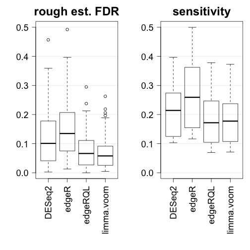
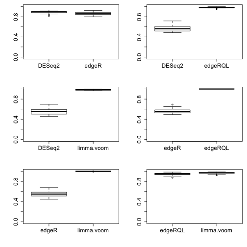

# Bottomly plots


### Condition and batch in test and heldout


```r
# plot the test and heldout sets coloring condition and batch
library(rafalib)
bigpar(2,2)
cols <- c("orange","purple","dodgerblue")
image(sapply(1:30, function(i) as.integer(strain[randomSubsets[i,1:6],])),
      col=cols, main="test cond")
image(sapply(1:30, function(i) as.integer(exper[randomSubsets[i,1:6],])),
      col=cols, main="test batch")
image(sapply(1:30, function(i) as.integer(strain[randomSubsets[i,7:21],])),
      col=cols, main="out cond")
image(sapply(1:30, function(i) as.integer(exper[randomSubsets[i,7:21],])),
      col=cols, main="out batch")
```


```
## 
## Attaching package: 'rafalib'
```

```
## The following object is masked from 'package:devtools':
## 
##     install_bioc
```

### Number of calls


```r
bigpar(1,2,mar=c(10,5,3,1))
boxplot(test, las=2, ylim=c(0,5000), main="n=3 #pos")
boxplot(held, las=2, ylim=c(0,5000), main="n=7/8 #pos")
```


Mean of calls in test set (n=3) and heldout set (n=7/8)


```r
round(colMeans(test))
```

```
##     DESeq2      edgeR    edgeRQL limma.voom 
##        736        760        424        412
```

```r
round(colMeans(held))
```

```
##     DESeq2      edgeR    edgeRQL limma.voom 
##       3047       2293       2106       2025
```

### FDR and sensitivity against heldout


```r
lines <- function() abline(h=0:10/10,col=rgb(0,0,0,.1))
bigpar(1,3,mar=c(10,5,3,1))
boxplot(fdr, las=2, ylim=c(0,0.5), main="rough est. FDR")
lines()
boxplot(fdr, las=2, ylim=c(0,1), main="rough est. FDR")
lines()
boxplot(sens, las=2, ylim=c(0,0.5), main="sensitivity")
lines()
```



Mean of the rough estimate of FDR (%) using the 7 vs 8 heldout set as ground truth:


```r
100 * round(colMeans(fdr),3)
```

```
##     DESeq2      edgeR    edgeRQL limma.voom 
##       13.5       22.0       15.2       14.7
```


### Overlap of method pairs in test


```r
bigpar(3,2,mar=c(5,5,1,1))
ylims <- c(0, 1)
boxplot(getOverlap("DESeq2","edgeR",resTest,.1), ylim=ylims)
boxplot(getOverlap("DESeq2","edgeRQL",resTest,.1), ylim=ylims)
boxplot(getOverlap("DESeq2","limma.voom",resTest,.1), ylim=ylims)
boxplot(getOverlap("edgeR","edgeRQL",resTest,.1), ylim=ylims)
boxplot(getOverlap("edgeR","limma.voom",resTest,.1), ylim=ylims)
boxplot(getOverlap("edgeRQL","limma.voom",resTest,.1), ylim=ylims)
```



### Overlap of method pairs in heldout


```r
bigpar(3,2,mar=c(5,5,1,1))
ylims <- c(0.6, 1)
boxplot(getOverlap("DESeq2","edgeR",resHeldout,.1), ylim=ylims)
boxplot(getOverlap("DESeq2","edgeRQL",resHeldout,.1), ylim=ylims)
boxplot(getOverlap("DESeq2","limma.voom",resHeldout,.1), ylim=ylims)
boxplot(getOverlap("edgeR","edgeRQL",resHeldout,.1), ylim=ylims)
boxplot(getOverlap("edgeR","limma.voom",resHeldout,.1), ylim=ylims)
boxplot(getOverlap("edgeRQL","limma.voom",resHeldout,.1), ylim=ylims)
```


